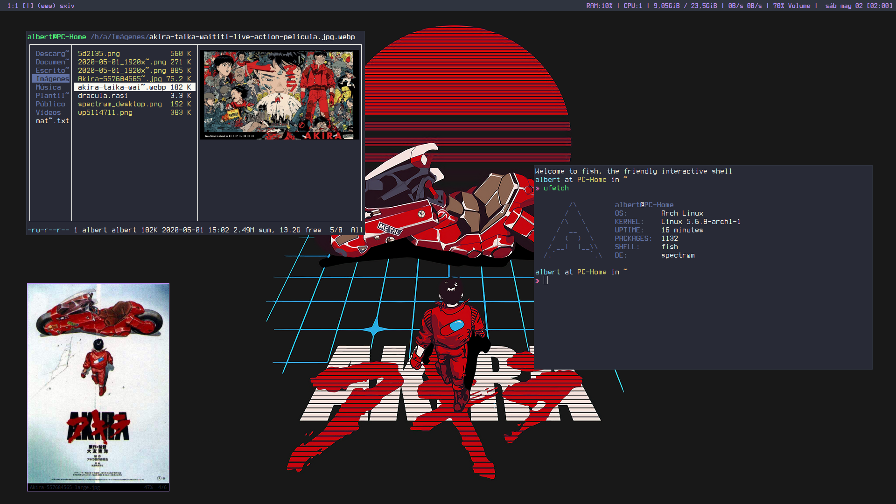
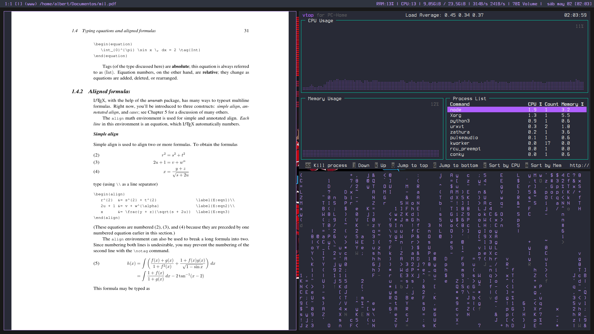
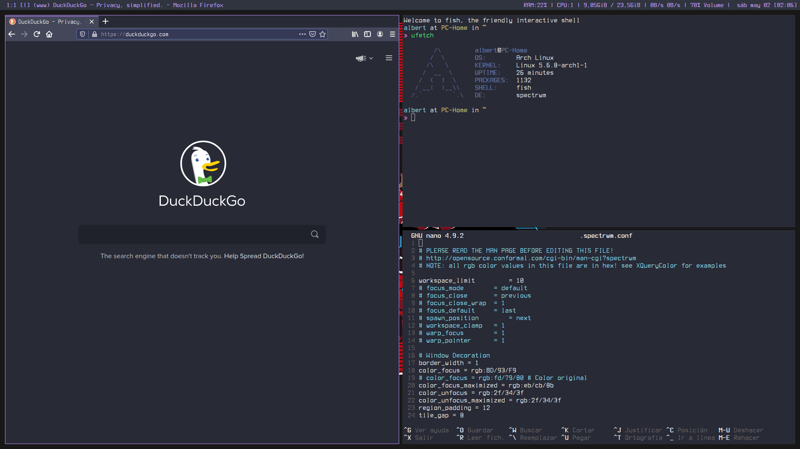

# What is Dotfiles?
Dotfiles are plain text configuration files on Unix-y systems for things like our shell, `~/.zshrc`, our editor in `~/.vimrc`, and many others. They are called "dotfiles" as they typically are named with a leading . making them hidden files on your system, although this is not a strict requirement.

Since these files are all plain text, we can gather them together in a git repository and use that to track the changes you make over time.

# Important
Some programs needs to be installed for the correct run of `~/.spectrwm.conf`. You can comment that lines if you want it.

### Example
```
program[lock]		= i3lock

program[term]		= urxvt

program[menu]		= rofi -show drun -font 'Terminus Bold 11'
```
### Applications installed
* [nerd-fonts-terminus](https://aur.archlinux.org/packages/?O=0&K=nerd+terminus)
* [ant-dracula-theme](https://aur.archlinux.org/packages/ant-dracula-theme-git/)
* [scrot](https://www.archlinux.org/packages/community/x86_64/scrot/)
* [ranger](https://www.archlinux.org/packages/community/any/ranger/)
* [sxiv](https://www.archlinux.org/packages/community/x86_64/sxiv/)
* [zathura](https://www.archlinux.org/packages/community/x86_64/zathura-pdf-mupdf/)
* [numix](https://aur.archlinux.org/packages/numix-gtk-theme/)
* [vtop](https://aur.archlinux.org/packages/vtop/)
* [nitrogen](https://www.archlinux.org/packages/extra/x86_64/nitrogen/)
* [rxvt-unicode](https://www.archlinux.org/packages/community/x86_64/rxvt-unicode/)
* [fish](https://www.archlinux.org/packages/community/x86_64/fish/)
* [rofi](https://www.archlinux.org/packages/community/x86_64/rofi/)
* [ufetch](https://aur.archlinux.org/packages/ufetch-git/)
* [omf](https://github.com/oh-my-fish/oh-my-fish)
* [lxappearance](https://www.archlinux.org/packages/community/x86_64/lxappearance/)
* [xcursor-neutral](https://www.archlinux.org/packages/community/any/xcursor-neutral/)


# License
The files and scripts in this repository are licensed under the MIT License, which is a very permissive license allowing you to use, modify, copy, distribute, sell, give away, etc. the software.  In other words, do what you want with it.  The  only requirement with the MIT License is that the license and copyright notice must be provided with the software.

# Images






