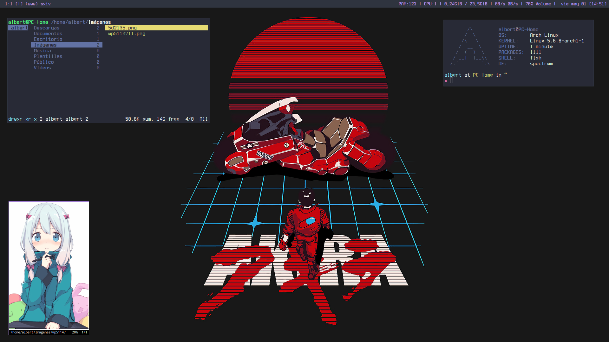
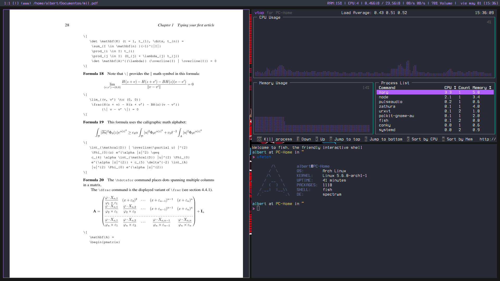
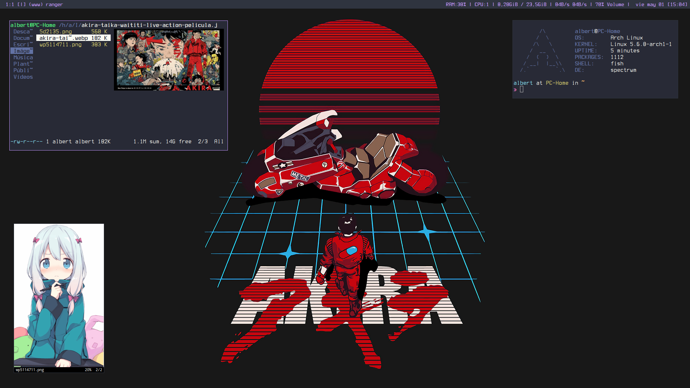

# Dotfiles

# What is Dotfiles?
Dotfiles are plain text configuration files on Unix-y systems for things like our shell, ~/.zshrc, our editor in ~/.vimrc, and many others. They are called "dotfiles" as they typically are named with a leading . making them hidden files on your system, although this is not a strict requirement.

Since these files are all plain text, we can gather them together in a git repository and use that to track the changes you make over time.

# Required
You do have to pay atention to the file spectrwm.conf, to run spectrwm correctly you do have to install that programs like rofi, i3lock, rxvt, etc.
If you don't install that programs spectrwm bar may not work correctly.

# License
The files and scripts in this repository are licensed under the MIT License, which is a very permissive license allowing you to use, modify, copy, distribute, sell, give away, etc. the software.  In other words, do what you want with it.  The  only requirement with the MIT License is that the license and copyright notice must be provided with the software.
